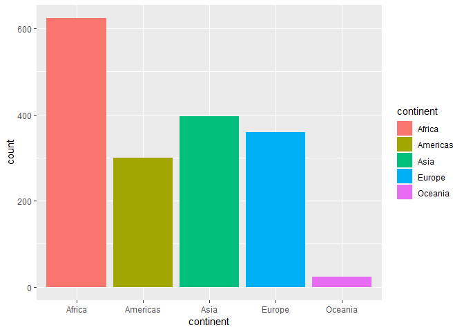
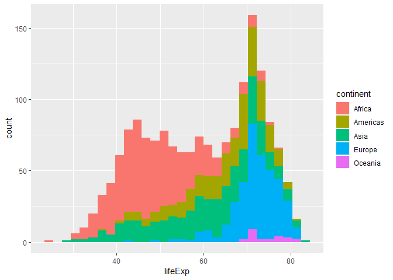
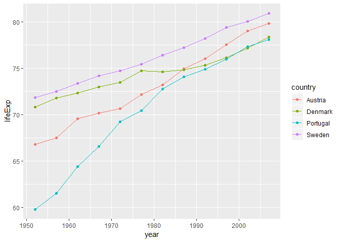
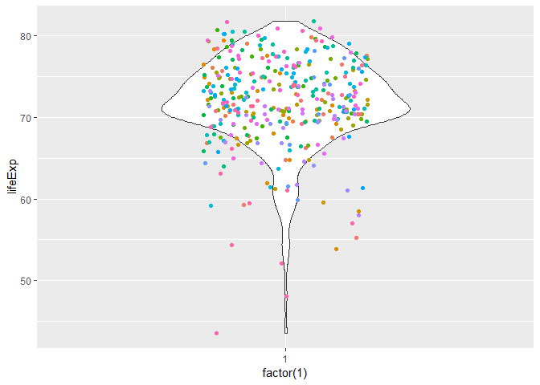
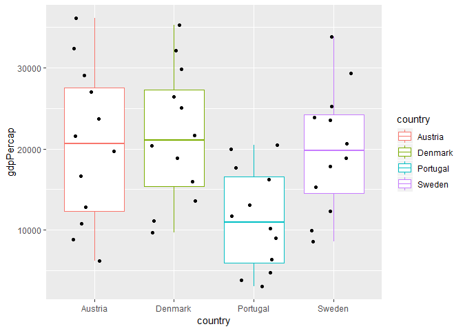
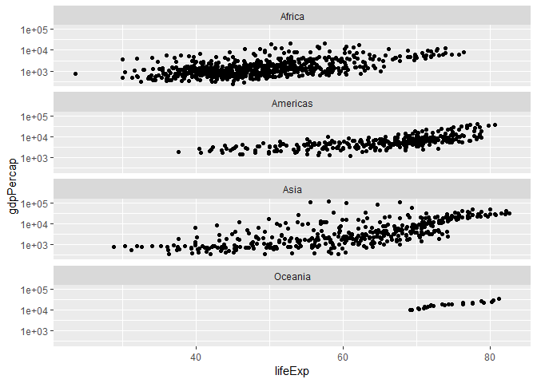
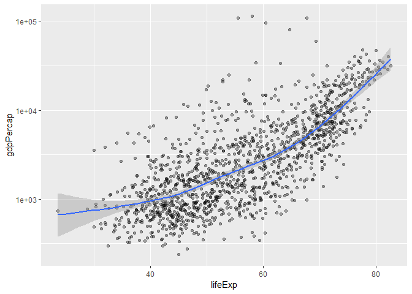

## R Markdown
## Step1: Loading Gapminder and Tidyverse 

```r
library(gapminder)
library(tidyverse)
```

```
## -- Attaching packages ----------------------------------------- tidyverse 1.2.1 --
```

```
## v ggplot2 3.0.0     v purrr   0.2.5
## v tibble  1.4.2     v dplyr   0.7.6
## v tidyr   0.8.1     v stringr 1.3.1
## v readr   1.1.1     v forcats 0.3.0
```

```
## -- Conflicts -------------------------------------------- tidyverse_conflicts() --
## x dplyr::filter() masks stats::filter()
## x dplyr::lag()    masks stats::lag()
```

```r
library(dplyr)
```


## Step2: Tests on the gapminder data frame

```r
typeof(gapminder)
```

```
## [1] "list"
```

```r
class(gapminder)
```

```
## [1] "tbl_df"     "tbl"        "data.frame"
```

```r
ncol(gapminder)
```

```
## [1] 6
```

```r
nrow(gapminder)
```

```
## [1] 1704
```

```r
dim(gapminder)
```

```
## [1] 1704    6
```

```r
length(gapminder)
```

```
## [1] 6
```

```r
str(gapminder)
```

```
## Classes 'tbl_df', 'tbl' and 'data.frame':	1704 obs. of  6 variables:
##  $ country  : Factor w/ 142 levels "Afghanistan",..: 1 1 1 1 1 1 1 1 1 1 ...
##  $ continent: Factor w/ 5 levels "Africa","Americas",..: 3 3 3 3 3 3 3 3 3 3 ...
##  $ year     : int  1952 1957 1962 1967 1972 1977 1982 1987 1992 1997 ...
##  $ lifeExp  : num  28.8 30.3 32 34 36.1 ...
##  $ pop      : int  8425333 9240934 10267083 11537966 13079460 14880372 12881816 13867957 16317921 22227415 ...
##  $ gdpPercap: num  779 821 853 836 740 ...
```

```r
sapply(gapminder, class)
```

```
##   country continent      year   lifeExp       pop gdpPercap 
##  "factor"  "factor" "integer" "numeric" "integer" "numeric"
```

```r
sapply(gapminder, typeof)
```

```
##   country continent      year   lifeExp       pop gdpPercap 
## "integer" "integer" "integer"  "double" "integer"  "double"
```

#### The above output gives the basic information about the data frame.
#### typof() function gives the data type of the function and in this case it is a "List"
#### nrow() and ncol() functions specify the number of rows and coloumn in the data frame. the output shows that the above data frame has "6 columns and 1704 rows"
#### dim() represents the dimension of the data frame in the form of matrix that is as rows and columns
#### str() generates the structure of the entire data frame and also specifies the class and levels of each element.
#### sapply() specifies the class and type of each individual element of teh data frame. For example, class(country) is "factor", typeof(country) is "interger"


## Step3: Part(a) Exploring individual variable-categorical; selecting Continent
#### Here I used a variable "a" to store the entire Continent's column.


```r
a <-select(gapminder, continent)
summary(a)
```

```
##     continent  
##  Africa  :624  
##  Americas:300  
##  Asia    :396  
##  Europe  :360  
##  Oceania : 24
```

```r
table(a)
```

```
## a
##   Africa Americas     Asia   Europe  Oceania 
##      624      300      396      360       24
```

```r
class(a)
```

```
## [1] "tbl_df"     "tbl"        "data.frame"
```

```r
ggplot(gapminder) +
  stat_count(aes(continent, fill=continent))
```

<!-- -->

#### The first output gives a brief summary of the variable. It comprises of 5 levels: Africa, Americas, Asia, Europe and Oceania.
#### table() generates the tabular form of the column
#### Combining ggplot with stats_count gives a distribution of continents indicating that Africa appeared the maximum number of times in the data set and Oceania appeared the least number of times.

## Step4: Part(b) Exploring individual variable-Quantitative: Selecting lifeExp
#### Here I used a variable "b" to store the entire lifeExp's column.


```r
b <- select(gapminder, lifeExp)
summary(b)
```

```
##     lifeExp     
##  Min.   :23.60  
##  1st Qu.:48.20  
##  Median :60.71  
##  Mean   :59.47  
##  3rd Qu.:70.85  
##  Max.   :82.60
```

```r
class(b)
```

```
## [1] "tbl_df"     "tbl"        "data.frame"
```

```r
ggplot(gapminder, aes(lifeExp)) +
  geom_histogram(aes(fill=continent))
```

```
## `stat_bin()` using `bins = 30`. Pick better value with `binwidth`.
```

<!-- -->

#### The summary() function gives the distributions of lifeExp in the form of Mean, Median and Quartiles.
#### The histogram shows that lifeExp of Oceania is least. For the rest of the countries, lifeExp is spread out. 


## Step4: Exploring various Plots

#### Plots for two quantitative variables:


```r
gapminder %>% 
  filter(continent == "Europe" & country %in% c("Austria", "Denmark", "Portugal", "Sweden") ) %>% 
  ggplot(aes(year, lifeExp)) +
  geom_point(aes(color=country)) +
  geom_line(aes(color=country))
```

<!-- -->
#### The above output shows that as lifeExp increases, gdpPercap also increases. Also, out of the above 4 countries in Europe, Portugal has shown the maximum change.


#### Plot for one Quantitative variable: lifeExp


```r
gapminder %>% 
  filter(continent == "Europe") %>% 
  ggplot(aes(factor(1), lifeExp)) +
  geom_violin(width = 0.6) +
  geom_jitter(aes(color=country), show.legend = FALSE, width = 0.2)
```

<!-- -->

#### The plot shows that the average life expectancy in Europe is between 70-75 years.

#### Plot for one quantitative and one categorical variable


```r
gapminder %>% 
   filter(continent == "Europe" & country %in% c("Austria", "Denmark", "Portugal", "Sweden") ) %>% 
  ggplot(aes(country, gdpPercap)) +
  geom_boxplot(aes(color=country))+
  geom_jitter(width=0.3)
```

<!-- -->

#### The output from the above plot shows that out of the 4 countries gdpPercap of Portugal is the least. One reason behind could be low life Expectancy.


## Step5: Other Explorations of ggplots()

#### Exploring Facetting


```r
gapminder %>% 
  filter(continent != "Europe") %>% 
  ggplot(aes(lifeExp, gdpPercap)) +
  scale_y_log10() +
  geom_point() +
  facet_wrap(~continent, nrow=4)
```

<!-- -->
#### The above plots were obtained by using the facet_wrap() command which gave the output as 4 different plots each for a particular continent.The common conclusion from all the plots is that lifeExp and gdpPercap have a linear relationship that is as lifeExp increases, gdpPercap increases.


#### Exploring geom_smooth()


```r
gapminder %>% 
  filter(continent != "Europe") %>% 
  ggplot(aes(lifeExp, gdpPercap)) +
  scale_y_log10() +
  geom_point(alpha=0.35) +
  geom_smooth()
```

```
## `geom_smooth()` using method = 'gam' and formula 'y ~ s(x, bs = "cs")'
```

<!-- -->

#### geom_smooth gives a smooth curve making data inference much easier. It can be concluded that if lifeExp is less, gdpPercap is low and vice-versa. 


#### Exploring dplyr

```r
gapminder %>% 
  mutate(ratio = (lifeExp/gdpPercap)) %>% 
  select(ratio, everything()) %>% 
  head
```

```
## # A tibble: 6 x 7
##    ratio country     continent  year lifeExp      pop gdpPercap
##    <dbl> <fct>       <fct>     <int>   <dbl>    <int>     <dbl>
## 1 0.0370 Afghanistan Asia       1952    28.8  8425333      779.
## 2 0.0370 Afghanistan Asia       1957    30.3  9240934      821.
## 3 0.0375 Afghanistan Asia       1962    32.0 10267083      853.
## 4 0.0407 Afghanistan Asia       1967    34.0 11537966      836.
## 5 0.0488 Afghanistan Asia       1972    36.1 13079460      740.
## 6 0.0489 Afghanistan Asia       1977    38.4 14880372      786.
```
#### The above output was obtained using the dplyr function mutate(). It creates a new column by combining two or columns of the data frame. The first column of the output shows the ratio of lifeExp and gdpPercap.


```r
gapminder %>% 
  filter(continent == "Europe") %>% 
  summarise(avg_lifeExp = mean(lifeExp), avy_gdp = mean(gdpPercap))
```

```
## # A tibble: 1 x 2
##   avg_lifeExp avy_gdp
##         <dbl>   <dbl>
## 1        71.9  14469.
```
#### The above output was obtained using the dplyr function summarise(). Stat function mean() gave the average lifeExp and gdpPercap of Europe as 71.9 dbl and 14469.5 dbl respectively.


#### Exploring Tables

#### Loading knitr and kable into R markdown


```r
library(knitr)
library(kableExtra)
```


#### Creating table using the first 6 rows and columns and exploring few some styling options


```r
g <- gapminder[1:6,1:6]
  kable(g) %>% 
  kable_styling(bootstrap_options = c("striped")) %>% 
  row_spec(1:6, background = "yellow")
```

<table class="table table-striped" style="margin-left: auto; margin-right: auto;">
 <thead>
  <tr>
   <th style="text-align:left;"> country </th>
   <th style="text-align:left;"> continent </th>
   <th style="text-align:right;"> year </th>
   <th style="text-align:right;"> lifeExp </th>
   <th style="text-align:right;"> pop </th>
   <th style="text-align:right;"> gdpPercap </th>
  </tr>
 </thead>
<tbody>
  <tr>
   <td style="text-align:left;background-color: yellow;"> Afghanistan </td>
   <td style="text-align:left;background-color: yellow;"> Asia </td>
   <td style="text-align:right;background-color: yellow;"> 1952 </td>
   <td style="text-align:right;background-color: yellow;"> 28.801 </td>
   <td style="text-align:right;background-color: yellow;"> 8425333 </td>
   <td style="text-align:right;background-color: yellow;"> 779.4453 </td>
  </tr>
  <tr>
   <td style="text-align:left;background-color: yellow;"> Afghanistan </td>
   <td style="text-align:left;background-color: yellow;"> Asia </td>
   <td style="text-align:right;background-color: yellow;"> 1957 </td>
   <td style="text-align:right;background-color: yellow;"> 30.332 </td>
   <td style="text-align:right;background-color: yellow;"> 9240934 </td>
   <td style="text-align:right;background-color: yellow;"> 820.8530 </td>
  </tr>
  <tr>
   <td style="text-align:left;background-color: yellow;"> Afghanistan </td>
   <td style="text-align:left;background-color: yellow;"> Asia </td>
   <td style="text-align:right;background-color: yellow;"> 1962 </td>
   <td style="text-align:right;background-color: yellow;"> 31.997 </td>
   <td style="text-align:right;background-color: yellow;"> 10267083 </td>
   <td style="text-align:right;background-color: yellow;"> 853.1007 </td>
  </tr>
  <tr>
   <td style="text-align:left;background-color: yellow;"> Afghanistan </td>
   <td style="text-align:left;background-color: yellow;"> Asia </td>
   <td style="text-align:right;background-color: yellow;"> 1967 </td>
   <td style="text-align:right;background-color: yellow;"> 34.020 </td>
   <td style="text-align:right;background-color: yellow;"> 11537966 </td>
   <td style="text-align:right;background-color: yellow;"> 836.1971 </td>
  </tr>
  <tr>
   <td style="text-align:left;background-color: yellow;"> Afghanistan </td>
   <td style="text-align:left;background-color: yellow;"> Asia </td>
   <td style="text-align:right;background-color: yellow;"> 1972 </td>
   <td style="text-align:right;background-color: yellow;"> 36.088 </td>
   <td style="text-align:right;background-color: yellow;"> 13079460 </td>
   <td style="text-align:right;background-color: yellow;"> 739.9811 </td>
  </tr>
  <tr>
   <td style="text-align:left;background-color: yellow;"> Afghanistan </td>
   <td style="text-align:left;background-color: yellow;"> Asia </td>
   <td style="text-align:right;background-color: yellow;"> 1977 </td>
   <td style="text-align:right;background-color: yellow;"> 38.438 </td>
   <td style="text-align:right;background-color: yellow;"> 14880372 </td>
   <td style="text-align:right;background-color: yellow;"> 786.1134 </td>
  </tr>
</tbody>
</table>

## Step6: Commit and Push to github Repo
